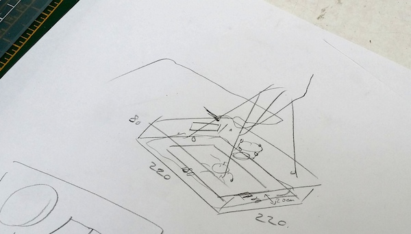

## Making the box enclosure

To make the box, we recommend lasercutting it out of 3mm plywood. The simplest way to do this is find a local makerspace/hackspace with a lasercutter and politely ask them if they can help.

Many schools now also have small lasercutters so you may be able to ask your Design and Technology department if they can help. If you don't have access to a lasercutter, you could make the box out of tough cardboard.

The required file ready to cut can be found [here](../en/resources/Box-design.pdf).

The design is also available in a number of different formats which can be found [here](https://github.com/raspberrypilearning/grandpa-scarer/tree/master/en/resources).

The settings required are as follows:

- **Black** - Cut directly through
- **Red** - Lower power to just score the wood.

The required cutting area is 450mm x 400mm. If your lasercutter bed is smaller than that, then open the file in a program like Inkscape or Adobe Illustrator and split it into 2 sheets.

**As every lasercutter is different and lasers are dangerous, please only operate a lasercutter if you are trained to use that specific lasercutter, and if its owner is happy for you to do so.**

### Lasercut the box 

Use the settings given above.

	
### Glue the box

Use a hot-glue gun to glue all the pieces of the box together. You may need someone else to help you to hold the box together as you glue it. Don't be worried if the glue goes everywhere: no one sees the inside of the box!

### Attach the hinges

Grab your hinges and glue them onto the opposite side of the servo mount, on the top side of the box.

    
  

