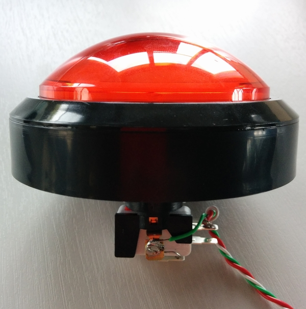
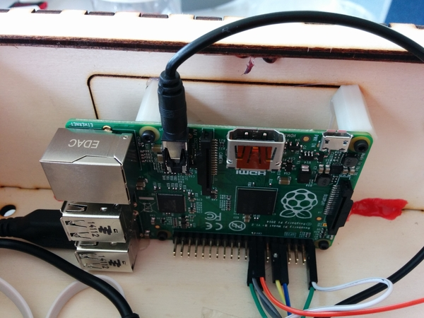

##Step 0: Setup your Raspberry Pi
You will need to set up your Raspberry Pi to take part in this activity. [See the Raspberry Pi Quick Start Guide here](http://www.raspberrypi.org/quick-start-guide) to get you up and running.

Then to make sure everything is up to date, open an lxterminal and enter
```sudo apt-get update && upgrade```

##Step 1: Making the box enclosure


To make the box, we recommend lasercutting it out of 3mm plywood. The simplest way to do this is find a local makerspace/hackspace with a lasercutter and politely ask them if they can help.
Many schools now also have small lasercutters so you may be able to ask your Design and Technology department if they can help.
The required file ready to cut can be found here -
The settings required are as follows
- **Black** - Cutting completely through power
- **Red** - Score power, should only leave faint lines

The required cutting area is 550mm x 400mm. If your lasercutter bed is smaller than that then open the file in the program like Inkscape or Adobe Illustrator and split it into 2 sheets.

**As every lasercutter is different and lasers are dangerous, please only operate a lasercutter if you are trained to use that specific lasercutter and its owner is happy with you doing so.**

1. Lasercut the box using the settings above.


2. Use a hot-glue gun to glue all the pieces of the box together. You may need someone else to help you to hold the box together as you glue it. Don't be worried if it goes everywhere, no one sees the inside of the box!


3. Grab your hinges and hot glue them on the opposite side of the servo mount on the top side of the box.


  


##Step 2: Using a servo


Servos are small motors with control circuitery embedded that can turn up to 180 degrees.
You control the servo by turning one of the GPIO pins on and off at an incredibly fast rate. The length of the pulses (also known as pulse width) is what controls which direct the servo is pointing in.
These signals are called PWM (Pulse Width Modulation) and allows you to do all maner of things from dimming LEDs to driving motors slower than normal.
The Raspberry Pi as standard does not support generating these PWM signals as it does not have a dedicated clock system to do it. For this project we are using software generated PWM signals. The drawback of this though is the signals won't be perfect so the servo may jiggle back and forth a bit.

####Using a servo with RPi.GPIO
We will be using a servo for the latch that holds the panel closed.
RPi.GPIO allows for really easy software PWM to be added to your Python programs.
``` python
#Setup libraries and overall settings
import RPi.GPIO as GPIO  #Imports the standard Raspberry Pi GPIO library
from time import sleep   #Imports sleep (aka wait or pause) into the program
GPIO.setmode(GPIO.BOARD) #Sets the pin numbering system to using the physical layout

#Setup pin 11 for PWM
GPIO.setup(11,GPIO.OUT)  #Sets up pin 11 to an output (instead of an input)
p = GPIO.PWM(11, 50)     #Sets up pin 11 as a PWM pin
p.start(0)               #Starts running PWM on the pin and sets it to 0

#Move the servo back and forth
p.ChangeDutyCycle(3)     #Changes the pulse width to 3 (so moves the servo)
sleep(1)                 #Wait 1 second
p.ChangeDutyCycle(12)    #Changes the pulse width to 12 (so moves the servo)
sleep(1)

#Cleanup everything
p.stop()                 #At the end of the program, stop the PWM
GPIO.cleanup()           #Resets the GPIO pins back to defaults
```


##Step 3: Wiring the button and LED up

In order for your grandpa scarer to be activated you will need to hook up a button of some kind - preferably with a long wire attached to it so that you can be far far away when you scare someone. Here is the button that we used:



Buttons work on this concept - you have two wires, one connected to ground and the other to one of the GPIO pins on the Pi. You would think that if you set this pin as an input then you'd very easily be able to view the button being pressed. Sadly that is not the case. If we do this then the Pi will not know what state the button is in. This is called a floating input and even things like moving the wires will cause it to change randomly... In order to fix this we need to use the Pi's inbuilt pull up resistors. These are clever little things as they 'pull up' the button into one state. That way when you hit it the Pi will see that it has definitely changed.

Now that you understand the basic principles behind the button's operation lets wire it up. First off you should have two wires connected to two of the pins on your button. The one we used had two clearly marked pins for this however it is not uncommon for buttons (especially the breadboard variety) to have four legs - these are just two sets of two and so make sure that you only wire up one set. TIP: Colour code them. Our wires were around six meters long in order for a maximum scaring distance!

Now that you have two wires connected to your button you will now need to wire it up to your Raspberry Pi. Firstly we are going to connect one of the wires to ground - with buttons it doesn't matter which one of the wires you use! As we will be connecting to the Pi's male GPIO pins and the wire from your button will most likely be male as well, it is advisable to use a female to female jumper wire inbetween the two to make wiring that little bit easier. Without further ado connect a wire from your button to pin 6 of the Pi: ground. Here is a diagram:


Next we need to wire up the other wire from the button - this is going straight to one of the Pi's input pins in order for us to be able to read it. Again, using female to female jumper wires connect the remaining wire from your button to pin 18 on the Pi like so:


And that is it! Your button is now all wired up. If you have a mess of long cables wired up to it it would be advisable to connect them to a drill and spin them together

##Step 4: Playing sounds

One of the key aspects of your grandpa scarer is the loud noise that it will make when you hit the button and your spider springs out. We want the sound to be frightening and *almost* deafening. The Pi doesn't have any inbuilt speakers so how do you go about doing this? The answer is to use a small portable speaker that can easily connect to the Pi's 3.5mm audio jack here:


We recommend the Pi Hut's one as it is small, nifty and powerful. You can easily hold it in place in the enclosure with two cable ties and it can be charged from the Pi using its accompanying micro USB cable.

Why don't you go ahead and mount it into the enclosure (making sure it is turned on using the button on the bottom of the speaker) and plug the power lead (micro USB to USB) into the Pi and the 3.5mm audio cable into the jack on the Pi and the jack on the Pi Hut speaker.

##Step 5: Assembly

Now you'll need to mount all of your electronics into your box. As the Pi is the brains of the entire operation you'll need to mount that first. You can see a laser engraved outline for where the Pi should sit located on the right hand side of the inside of the box. This is optimized for the Raspberry Pi B+ as there are four mounting holes. As you can see from the picture below we used spacers (3D printed ones) and screws to fasten our Pi in the enclosure however you could quite easily screw it straight onto the side.



Now with the Pi attached to your box you should put the speaker in the middle (where the laser cut outline is) and secure it in place with two cable ties like so:


Then with the speaker and Pi in place we can fix our servo in place. There are laser cut spaces for screw holes however we just used sugru to bodge it into place. Make sure the servo horn is going to be useful for holding the lid in place. Take a look at this image:


When attaching things like servos be careful! You don't want to move any wires by accident!

Now you should thread your power supply and button's wires through the opening that is on the enclosure (see image). If you dont do this then everything will be trapped in the box!


Penultimately you'll have to attach your elastic thread to your spider. We used a little bit of hot glue to do this but you could use an alternative such as sugru or super glue.


Finally attach the other end of the elastic thread to your box and place the spider upside down inside it like so:


Now close the lid and put the servo in place using its servo horn. We're ready to start coding!


##Step 6: Code

##Step 7: Scare a grandpa
