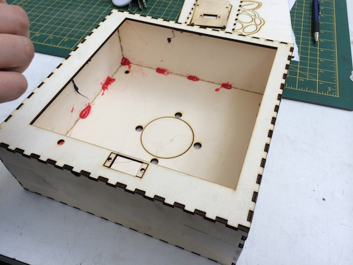
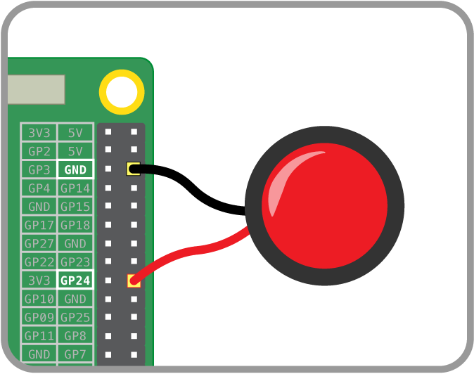
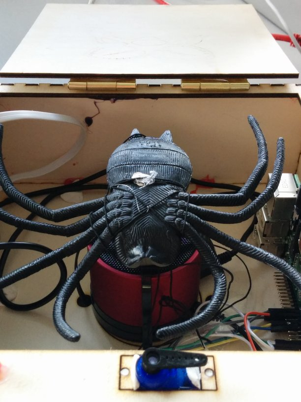
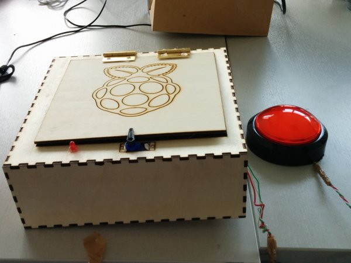

# Grandpa Scarer

## Making the box enclosure


To make the box, we recommend lasercutting it out of 3mm plywood. The simplest way to do this is find a local makerspace/hackspace with a lasercutter and politely ask them if they can help.

Many schools now also have small lasercutters so you may be able to ask your Design and Technology department if they can help. If you don't have access to a lasercutter, you could make the box out of tough cardboard.

The required file ready to cut can be found [here](design-files/Box-design.pdf).

The design is also available in a number of different formats which can be found [here](https://github.com/raspberrypilearning/grandpa-scarer/tree/master/design-files).

The settings required are as follows:

- **Black** - Cut directly through
- **Red** - Lower power to just score the wood.

The required cutting area is 450mm x 400mm. If your lasercutter bed is smaller than that, then open the file in a program like Inkscape or Adobe Illustrator and split it into 2 sheets.

**As every lasercutter is different and lasers are dangerous, please only operate a lasercutter if you are trained to use that specific lasercutter, and its owner is happy with you doing so.**

### Lasercut the box 

Use the settings given above.

	
	
### Glue the box

Use a hot-glue gun to glue all the pieces of the box together. You may need someone else to help you to hold the box together as you glue it. Don't be worried if the glue goes everywhere: no one sees the inside of the box!

    

### Attach the hinges

Grab your hinges and glue them onto the opposite side of the servo mount, on the top side of the box.

    
    
      

## Using a servo


Servos are small motors with embedded control circuitry that can turn up to 180 degrees.

You control the servo by turning one of the GPIO pins on and off at an incredibly fast rate. The length of the pulses (also known as pulse width) is what controls which direction the servo is pointing in.

These signals are called PWM (Pulse Width Modulation) and allow you to do all maner of things, from dimming LEDs to driving motors slower than normal.

The Raspberry Pi as standard does not support generating these PWM signals, as it does not have a dedicated clock system to do it. For this project we are using software-generated PWM signals. The drawback of this, though, is the signals won't be perfect, so the servo may jiggle back and forth a bit.

### Wiring up your servo

Servos have three leads coming from them. Normally, the brown/black one is ground, the red is 5v (for hobby servos), and yellow/orange is the signal. We will use male to female jumper wires in order to connect the female pins of the servo to the Pi's GPIO pins. First connect the brown/black wire of your servo to pin 9 of the Pi. Then attach the red wire of your servo to pin 2 - the 5v pin of the Pi. Finally, connect the control wire of the servo (yellow/orange) to pin 11 on the Pi. Here's a circuit diagram:


### Using a servo with RPi.GPIO

We will be using a servo for the latch that holds the panel closed.

RPi.GPIO allows for really easy software PWM to be added to your Python programs.

``` python
# Set up libraries and overall settings
import RPi.GPIO as GPIO  # Imports the standard Raspberry Pi GPIO library
from time import sleep   # Imports sleep (aka wait or pause) into the program
GPIO.setmode(GPIO.BOARD) # Sets the pin numbering system to use the physical layout

# Set up pin 11 for PWM
GPIO.setup(11,GPIO.OUT)  # Sets up pin 11 to an output (instead of an input)
p = GPIO.PWM(11, 50)     # Sets up pin 11 as a PWM pin
p.start(0)               # Starts running PWM on the pin and sets it to 0

# Move the servo back and forth
p.ChangeDutyCycle(3)     # Changes the pulse width to 3 (so moves the servo)
sleep(1)                 # Wait 1 second
p.ChangeDutyCycle(12)    # Changes the pulse width to 12 (so moves the servo)
sleep(1)

# Clean up everything
p.stop()                 # At the end of the program, stop the PWM
GPIO.cleanup()           # Resets the GPIO pins back to defaults
```

## Wiring up the button

In order for your grandpa scarer to be activated you will need to hook up a button of some kind, preferably with a long wire attached to it so that you can be far, far away when you scare someone. Here is the button that we used:


Buttons work on this concept - you have two wires, one connected to ground and the other connected to a GPIO pin (we had an additional wire to try out the LED in the button which didn't work). When you press the button, the circuit completes and the GPIO pin sees ground. You would think that is all that is needed but if we leave it here, we may get left with a "floating input". A floating input occurs when the GPIO pin is connected to nothing; in other words, when the button is not being pressed it is connected to nothing. The issue with this is the GPIO pin value will float back and forth between a 0 and 1 randomly.

### Pull up resistors

To fix this issue, we use the Raspberry Pi's clever little built in pull up resistors. These work by connecting the GPIO pin to 3.3v via a very large resistance resistor (usually 10k!). This is a difficult path for the current to take, so it only takes it as a last resort. If the button isn't pushed this is the only option so the GPIO pin sees 3.3v; but if the button is pressed, it sees ground which is much easier to get to as it has no massive resistor. We could quite easily build this circuit on a breadboard ourselves but the Raspberry Pi has it built-in on every GPIO pin, so why create more work for ourselves?

### Wiring it up

Now that you understand the basic principles behind the button's operation, let's wire it up. First off, you should have two wires connected to two of the pins on your button. The one we used had two clearly marked pins for this, however it is not uncommon for buttons (especially the breadboard variety) to have four legs; these are just two sets of two, so make sure that you only wire up one set. TIP: Colour code them. Our wires were around six metres long for a maximum scaring distance!

Now that you have two wires connected to your button, you will now need to wire it up to your Raspberry Pi. Firstly, we are going to connect one of the wires to ground; with buttons it doesn't matter which one of the wires you use! As we will be connecting to the Pi's male GPIO pins and the wire from your button will most likely be male as well, it is advisable to use a female to female jumper wire in between the two to make wiring that little bit easier. Without further ado, connect a wire from your button to pin 6 of the Pi (ground). Here is a diagram:


Next we need to connect the other wire from the button; this is going straight to one of the Pi's input pins in order for us to be able to read it. Again, using female to female jumper wires, connect the remaining wire from your button to pin 18 on the Pi like so:



And that is it! Your button is now all wired up. If you have a mess of long cables now going to the button, it may be an idea to put one end of each into a hand drill and have a friend hold the other end. Then spin the drill to wind the cables together. You may need to use tape to help stop it unwinding.

Now let's have a look at the code that we need to read the input of a button:

```python
import RPi.GPIO as GPIO
import time

# Sets the Pi so it knows we are using the physical pin numbering
GPIO.setmode(GPIO.BOARD)

# Sets up pin 18 as an input
GPIO.setup(18, GPIO.IN, GPIO.PUD_UP)

# Detects the button being pressed
def waitButton():
    GPIO.wait_for_edge(18, GPIO.RISING)
    print('Button pressed!')

# Runs function
waitbutton()
```

## Playing sounds

One of the key aspects of your grandpa scarer is the loud noise that it will make when you hit the button and your spider springs out. We want the sound to be frightening and *almost* deafening. The Pi doesn't have any bulit-in speakers, so how do you go about doing this? The answer is to use a small portable speaker that can easily connect to the Pi's 3.5mm audio jack here:


We recommend the Pi Hut's one as it is small, nifty, and powerful. You can easily hold it in place in the enclosure with two cable ties, and it can be charged from the Pi using its accompanying micro USB cable.

Go ahead and plug it into your Raspberry Pi, making sure it is turned on using the button on the bottom of the speaker. Plug the power lead (micro USB to USB) into the Pi, then plug the 3.5mm audio cable into the jack on the Pi and the jack on the Pi Hut speaker. We have included some scary sounds in the code directory - feel free to add your own and edit the program!

Now let's have a look at the Python code to play those noises:

```python
import time
import pygame
import random

def sound():
    sounds = [
        "Female_Scream_Horror-NeoPhyTe-138499973.mp3",
        "Monster_Gigante-Doberman-1334685792.mp3",
        "Scary Scream-SoundBible.com-1115384336.mp3",
        "Sick_Villain-Peter_De_Lang-1465872262.mp3"
    ]
  
    choice = random.choice(sounds)

    pygame.mixer.init()
    pygame.mixer.music.load(choice)
    pygame.mixer.music.play()
  
    # Wait for the sound to finish
    while pygame.mixer.music.get_busy():
        continue
    time.sleep(0.3)

sound()
```

All the sounds can be found in the [sounds](https://github.com/raspberrypilearning/grandpa-scarer/tree/master/sounds) folder.

To get these on your Raspberry Pi, you can use:

```bash
wget http://goo.gl/SbK5YJ -O Sounds.zip --no-check-certificate
unzip Sounds.zip
```

## Assembly

Now you'll need to mount all of your electronics in your box. As the Pi is the brains of the entire operation you'll need to mount that first. You can see a laser engraved outline for where the Pi should sit, located on the right hand side of the inside of the box. This is optimised for the Raspberry Pi B+ as there are four mounting holes. As you can see from the picture below, we used 3D printed spacers and M2.5 screws to fasten our Pi in the enclosure; however, you could quite easily screw it straight onto the side.


Now with the Pi attached to your box, you should put the speaker in the middle (where the laser cut outline is) and secure it in place with two cable ties like so:


Then with the speaker and Pi mounted, we can fix our servo in place. There are laser cut spaces for screw holes; however we just used Sugru to bodge it into place. The servo horn is going to be useful for holding the lid in place. Take a look at this image as a guide:


When attaching things like servos be careful! You don't want to move any wires by accident!

Now you should thread your power supply and button's wires through the opening that is on the enclosure (see image). If you don't do this then everything will be trapped in the box!   
Note only the 2 wires coming from the button are needed (we had a third for some other testing).


Now you'll have to attach your elastic thread to your spider. We used a little bit of hot glue to do this, but you could use an alternative such as Sugru or Super Glue.


Finally, attach the other end of the elastic thread to your box and place the spider upside down inside it like so:



Now close the lid and put the servo in place using its servo horn. We're ready to start coding!



## Code

Now we put it all together and get this:

```python
import RPi.GPIO as GPIO
import time
import pygame
import random

GPIO.setmode(GPIO.BOARD)

GPIO.setup(11, GPIO.OUT)
GPIO.setup(16, GPIO.OUT)  
GPIO.setup(18, GPIO.IN, GPIO.PUD_UP)
p = GPIO.PWM(11, 50)
p.start(0)

def waitButton():
    GPIO.wait_for_edge(18, GPIO.RISING)  # Wait for the button to be pressed

def sound():
    sounds = [
        "Female_Scream_Horror-NeoPhyTe-138499973.mp3",
        "Monster_Gigante-Doberman-1334685792.mp3",
        "Scary Scream-SoundBible.com-1115384336.mp3",
        "Sick_Villain-Peter_De_Lang-1465872262.mp3",
    ]

    choice = random.choice(sounds)
    
    pygame.mixer.init()
    pygame.mixer.music.load(choice)
    pygame.mixer.music.play()

    # Wait for the sound to finish
    while pygame.mixer.music.get_busy():
        continue
    time.sleep(0.3)

# Main program section
while True:  # Forever loop (until you hit ctrl+c)
    try:
        waitButton()           # Wait until the button is pushed
        p.ChangeDutyCycle(3)   # Changes the pulse width to 3 (so moves the servo)
        time.sleep(0.1)        # Allow the servo to move
        sound()                # Play a sound file
        time.sleep(2)          # Wait for 2 seconds to allow you to release the button
        waitButton()           # Wait until the button is pushed
        p.ChangeDutyCycle(12)  # Changes the pulse width to 12 (so moves the servo back)
        time.sleep(1)          # Allow the servo to move and start program again
    except(KeyboardInterrupt):  
        p.stop()               # At the end of the program, stop the PWM
        GPIO.cleanup()         # Resets the GPIO pins back to defaults
```

## Scare a grandpa

Attach your box above an unsuspecting grandpa (or other family member or friend), using a secure method.

### Warning!!

**Please get an adult to attach the box, and only use it when they are completely confident it won't fall.**

If hanging the box using string, please make use of the four holes on the outer corners of the box to create a cradle of string to hang it from.

Above all though, be careful, as a wooden box falling on someone's head could cause serious harm!

## What next?

Other things to try:

- There is a hole in the design for a status LED. Why not try and get that flashing when the box is primed and ready to drop?
- Could you make it wireless? Instead of a big red button with a long cable, why not attach a USB WiFi adaptor and control it from another computer, or even better, your smartphone? Why not check out the [Networking Raspberry Pis exercise](http://www.raspberrypi.org/learning/networking-lessons/lesson-1/student-instructions-1.md) for how to use Python to send messages across a network.
